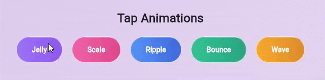
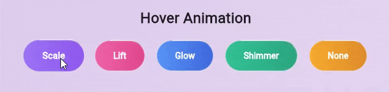
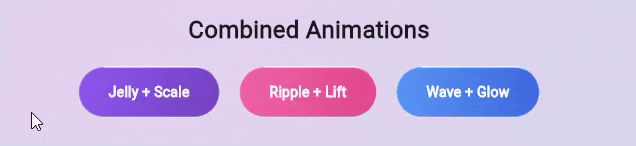
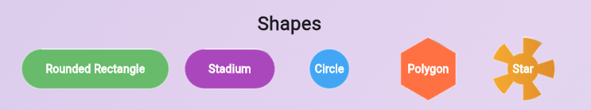

# 🎨 New Animated Button

A highly customizable, high-performance animated button for Flutter, featuring rich tap and hover effects powered by a custom rendering pipeline.

Built for **Flutter Web, Desktop, and Mobile** with a strong focus on smooth animations and performance.

---

## 📸 Preview

<!-- 
Place screenshots or GIFs here.
Example:


-->

---

## ✨ Features

- 🎈 **Advanced tap animations**
    - Jelly (physics-inspired deformation)
    - Scale
    - Ripple
    - Bounce
    - Wave

- 🖱️ **Hover animations** (Web & Desktop)
    - Scale
    - Lift
    - Glow
    - Shimmer

- 🧊 **Glassmorphism**
    - Optional translucent overlay
    - Highlight and border effects

- 🔺 **Custom shapes**
    - Rounded rectangle
    - Stadium
    - Circle
    - Polygon
    - Star
    - Fully custom paths

- ⏱️ **Long-press support**
    - Configurable duration
    - Visual progress indicator

- 🚀 **Performance-oriented**
    - CustomPainter + Listenable repaint
    - Optimized for Flutter Web
    - No unnecessary rebuilds
    - Pointer move throttling

---

## 📦 Installation

```yaml
dependencies:
  new_animated_button: ^1.0.0
```

```bash
flutter pub get
```

---

## 🚀 Quick Start

```dart
import 'package:flutter/material.dart';
import 'package:new_animated_button/new_animated_button.dart';

NewAnimatedButton(
  onPressed: () {
    debugPrint('Pressed');
  },
  tapAnimation: TapAnimation.jelly(),
  hoverAnimation: HoverAnimation.scale(),
  child: const Text(
    'Click Me',
    style: TextStyle(color: Colors.white),
  ),
)
```

---

## 🎯 Tap Animations

```dart
TapAnimation.jelly(),
TapAnimation.scale(),
TapAnimation.ripple(),
TapAnimation.bounce(),
TapAnimation.wave(),
```


---

## 🖱️ Hover Animations

```dart
HoverAnimation.scale();
HoverAnimation.lift();
HoverAnimation.glow();
HoverAnimation.shimmer();
HoverAnimation.none();
```


---

## 🧩 Combined Animations (Tap + Hover)

You can combine tap and hover animations together:

```dart
NewAnimatedButton(
  tapAnimation: TapAnimation.wave(),
  hoverAnimation: HoverAnimation.glow(),
  gradient: const LinearGradient(
  colors: [Color(0xFF3B82F6), Color(0xFF1D4ED8)],
  ),
  child: const Text(
  'Jelly + Lift',
  style: TextStyle(color: Colors.white, fontWeight: FontWeight.bold),
  ),
)
```


---

## 🧊 Glassmorphism

```dart
NewAnimatedButton(
  enableGlassmorphism: true,
  child: const Text('Glass'),
)
```

---

## 🔺 Custom Shapes

```dart
ButtonShape.roundedRectangle(radius: 30);
ButtonShape.stadium();
ButtonShape.circle();
ButtonShape.polygon(sides: 6);
ButtonShape.star(points: 5);
```


---

## ⏱️ Long Press

```dart
NewAnimatedButton(
  onLongPress: () {},
  longPressDuration: const Duration(milliseconds: 800),
  tapAnimation: TapAnimation.scale(),
  child: const Text('Hold Me'),
)
```

---

## ⚡ Performance Notes

- Uses CustomPainter repaint pipeline
- Optimized for Flutter Web
- No frame-jank on animation release

---

## 🌍 Platform Support

| Platform | Supported |
|---------|-----------|
| Android | ✅ |
| iOS | ✅ |
| Web | ✅ |
| Windows | ✅ |
| macOS | ✅ |
| Linux | ✅ |

---

## 📄 License

MIT License
